 

  
  <h2 align="center" style="font-weight: 600">renexmoe-tw527e-edition</h2>

  

    高顏值 OneManager 主題
      
    &nbsp;&nbsp;&nbsp;&nbsp;
    
     
     
  

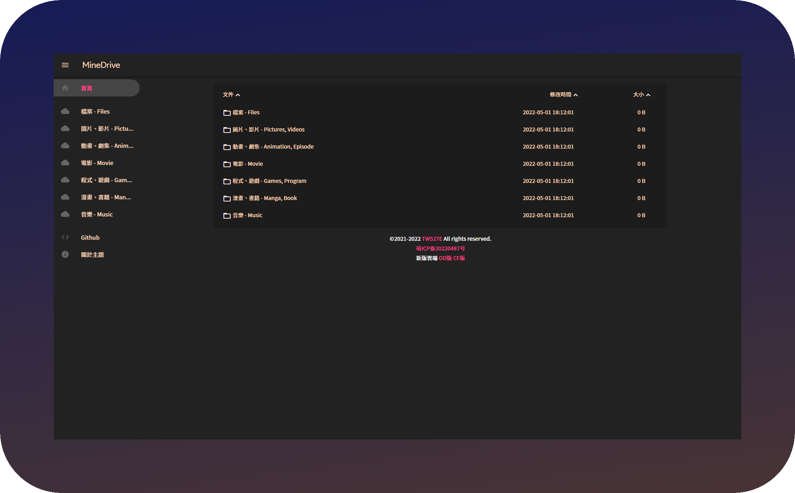

## ✨ 特性

- 🪵 增加 **`側邊欄`**
- 📟 增加 **`呼叫本地播放器`**
- ⏏️ 新增 **`頁腳`**
- 📍 **`backgroundm`** 選項調用至 **`網頁 Icon`**
- 🔲 增加 **`背景毛玻璃`**
- 🎨 **`主題顏色`** 調整為 **`奶茶色`**
- 📦 **`CDN`** 透過 [**`UNPKG`**](https://unpkg.com) 代理
- 📺 **`影片播放器`** 更改為 [**`DPlayer`**](https://dplayer.js.org)
- 🎵 **`音訊播放器`** 更改為 [**`APlayer`**](https://aplayer.js.org)
- 🕓 增加 **`自動恢復上次播放時間`**
- 📶 **`路徑`** 顯示於畫面最上方

🛠️ 修改項目

<Pre>

🔴 比較對象 [186526/onemanager-theme-renexmoe](https://github.com/186526/onemanager-theme-renexmoe)

- 🌏 將 **`語言`** 更改為 **`繁體中文`**
- 📍 將 **`backgroundm`** 選項內容調用至 **`網頁 Icon`**
- 🔲 增加 **`背景毛玻璃`**
- 🎨 **`主題顏色`** 調整為 **`奶茶色`**
- 📜 修復 **`PDF 預覽`**
- 📑 修復 **`OFFICE 預覽排版`**
- 📦 **`CDN`** 透過 [**`UNPKG`**](https://unpkg.com) 代理
- 📺 **`影片播放器`** 更改為 [DPlayer](https://dplayer.js.org)
- 🎵 **`音訊播放器`** 更改為 [APlayer](https://aplayer.js.org)
- 🕓 增加 **`自動恢復上次播放時間`**
- 📟 增加 **`呼叫本地播放器`**
- 🔠 將 **`字體`** 更改為 [Noto Sans TC SC HK](https://fonts.google.com/noto/fonts)
- ⏏️ 新增 **`頁腳`**
- 📶 修復 **`路徑未顯示盤名`**
- 🪛 修復 **`登入按鈕`**

</Pre>

## 📚 使用方法

此版本由 [@TW527E](https://github.com/TW527E) 維護，作用於 [OneManager-php](https://github.com/qkqpttgf/OneManager-php)

訪問此項目的 [Releases](releases) 頁面下載主題檔案

### ✅ 1: 下載至目錄

1. 下載 [**`renexmoe-tw527e-edition`**](https://github.com/TW527E/renexmoe-tw527e-edition/releases)
2. 將 **`renexmoe-tw527e-edition.html`** 複製至 **`/OneManager 根目錄/theme`**

### ⚠️ 2: 透過 customTheme 選項 (好像不行w)

1. 登入您的 OneManager 後台，並進入設定
2. 選擇 **`平台變數`** 頁面
3. 在 **`customTheme`** 選項內，輸入 **`https://raw.githubusercontent.com/TW527E/renexmoe-tw527e-edition/master/renexmoe-tw527e-edition.html`**
- `(jsDelivr: https://cdn.jsdelivr.net/gh/TW527E/renexmoe-tw527e-edition@master/renexmoe-tw527e-edition.html)`
4. 套用設定
5. 等待緩存刷新，完成

## 🔧 主題設定

🔲 背景毛玻璃

<Pre>

1. 登入您的 OneManager 後台，並進入設定
2. 選擇 **`平台變數`** 頁面
3. 在 **`customScript`** 選項內，輸入 **``**
4. 套用設定
5. 等待緩存刷新，完成 **`(請等待至少30分鐘，使customScript選項生效)`**
</Pre>

⏏️ 頁腳

<Pre>

1. 登入您的 OneManager 後台，並進入設定
2. 選擇 **`平台變數`** 頁面
3. 在 **`customScript`** 選項內，輸入 **``**
4. 套用設定
5. 等待緩存刷新，完成 **`(請等待至少30分鐘，使customScript選項生效)`**
</Pre>

## 🧿 已知問題

<strong><code>音樂播放器</code></strong> 在部分種類雲端會觸發防盜鏈，已將備用方案設為恢復原本播放器

<Pre>
已知：

- [x] 🟧 **`阿里雲盤`**
</Pre>

<strong><code>iOS</code></strong> 在部分內容支援不佳或處理速度異常

<Pre>
已知：

- 🎵 **`音樂播放器`**: 在不特定的情況下，因連結跳轉導致 iOS 拒絕存取
- 📺 **`影片播放器`**: 在尚未快取完成時，就開始播放，導致看起來好像已經開始播放，卻無畫面，直到快取完成時，才重新播放
- 🔳 **`背景圖片`**: 在眾多檔案的頁面中，背景會被拉長 [Safari Bug 219324](https://webkit.org/b/219324)
</Pre>

## 📜 開源許可

依據源專案之開源許可，本專案採用 [GPL-3.0 License](https://spdx.org/licenses/GPL-3.0-only.html)

## 🔴 靈感來源

源代碼來自 [186526/onemanager-theme-renexmoe](https://github.com/186526/onemanager-theme-renexmoe)

此版本修改來自 [jssycszyj/renexmoe-cdn](https://github.com/jssycszyj/renexmoe-cdn)

Readme 寫法及圖片做法來自 [qier222/YesPlayMusic](https://github.com/qier222/YesPlayMusic)

- [qkqpttgf/OneManager-php](https://github.com/qkqpttgf/OneManager-php)

- [zdhxiong/mdui](https://github.com/zdhxiong/mdui)

- [DIYgod/DPlayer](https://github.com/DIYgod/DPlayer)

- [DIYgod/APlayer](https://github.com/DIYgod/APlayer)

- [aadsm/jsmediatags](https://github.com/aadsm/jsmediatags)

- [fontsource/fontsource](https://github.com/fontsource/fontsource)

- [highlightjs/cdn-release](https://github.com/highlightjs/cdn-release)

- [mozilla/pdf.js](https://github.com/mozilla/pdf.js)

- [linkgod/SHA-1](https://github.com/linkgod/SHA-1)

- [google/fonts](https://github.com/google/fonts)

## 🎗️ 支持我

目前可以以下列方式支持我

- ⭐ Star 這個專案
- 🪛 Fork 這個專案
- 👥 <a href="https://t.me/Cheng_Group">加入 Telegram 群組</a>
- 🔴 目前還無法透過贊助的方式支持我 `(未成年又沒有銀行帳戶w)`

## 🖼️ 截圖 `(v1.0.22)`

💻 電腦

<Pre>

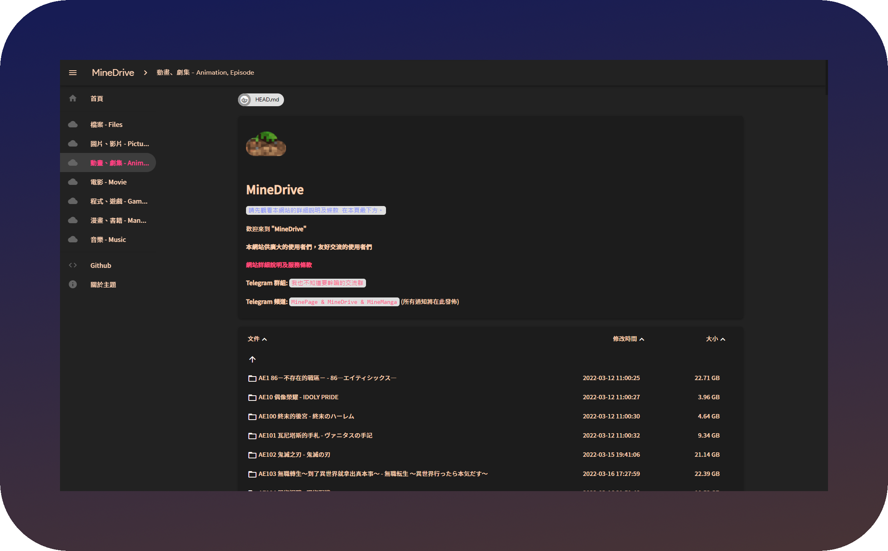
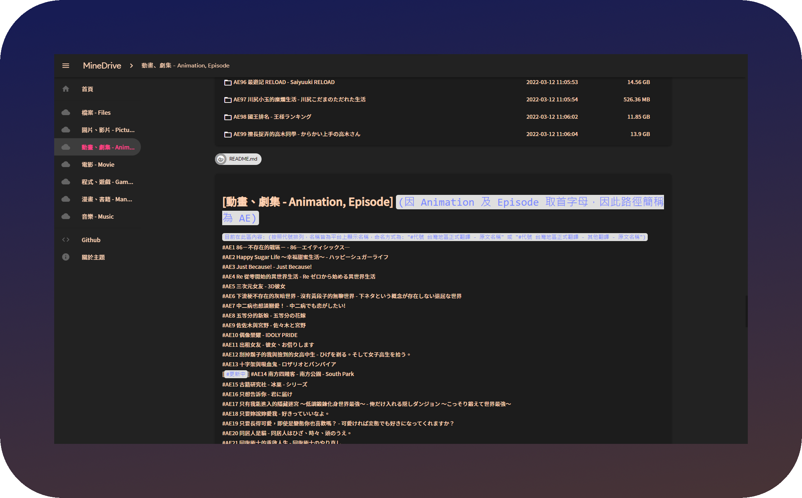
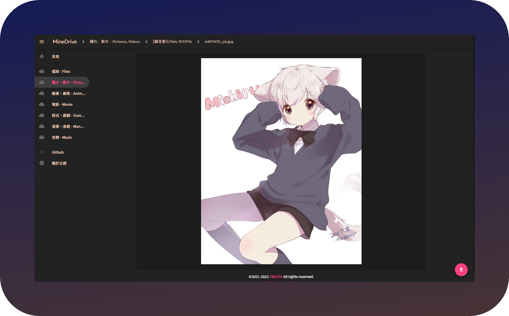
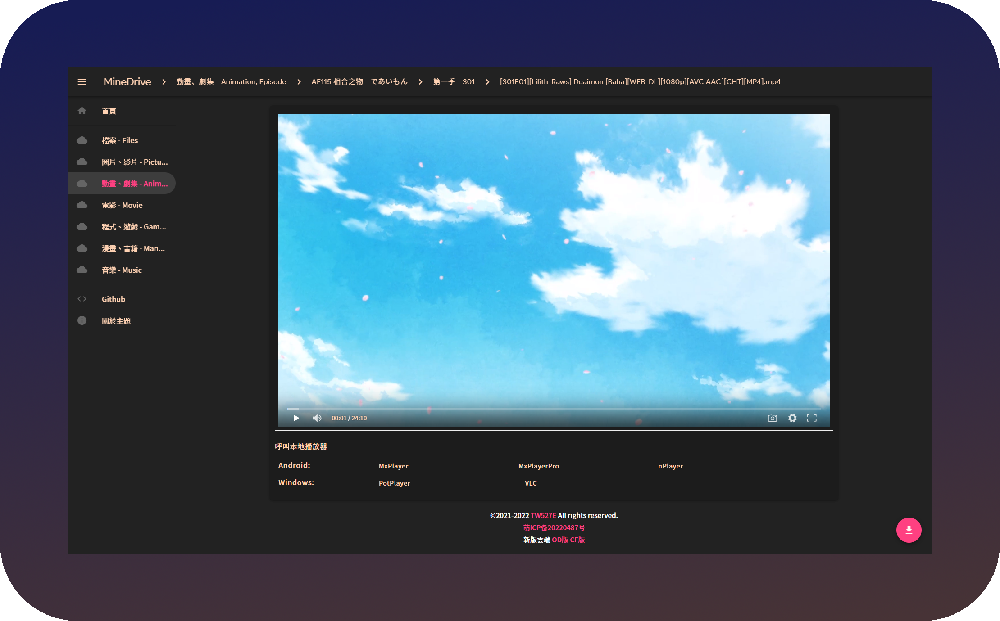
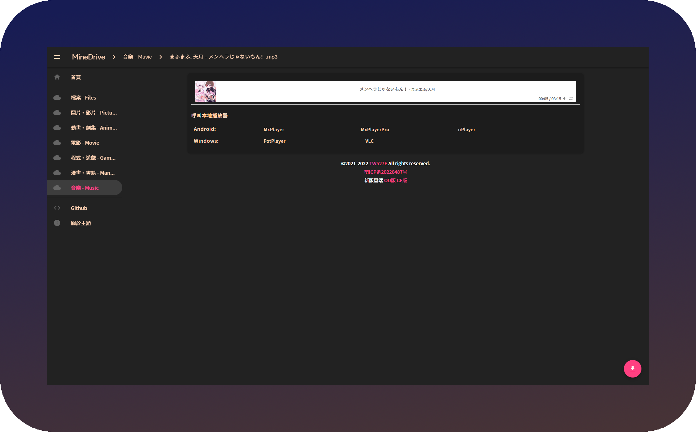
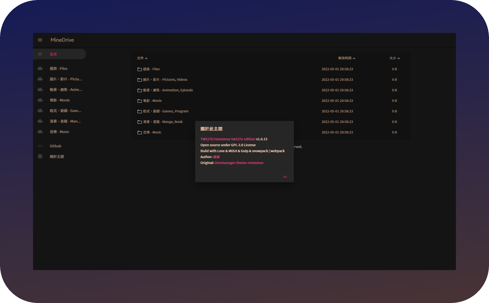

</Pre>

📱 手機

<Pre>

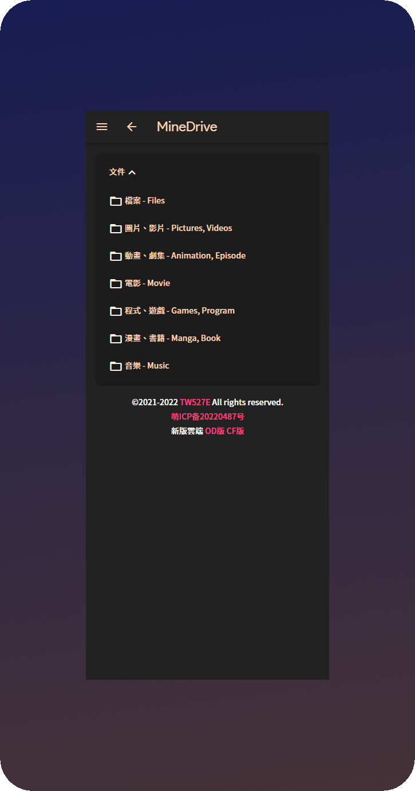
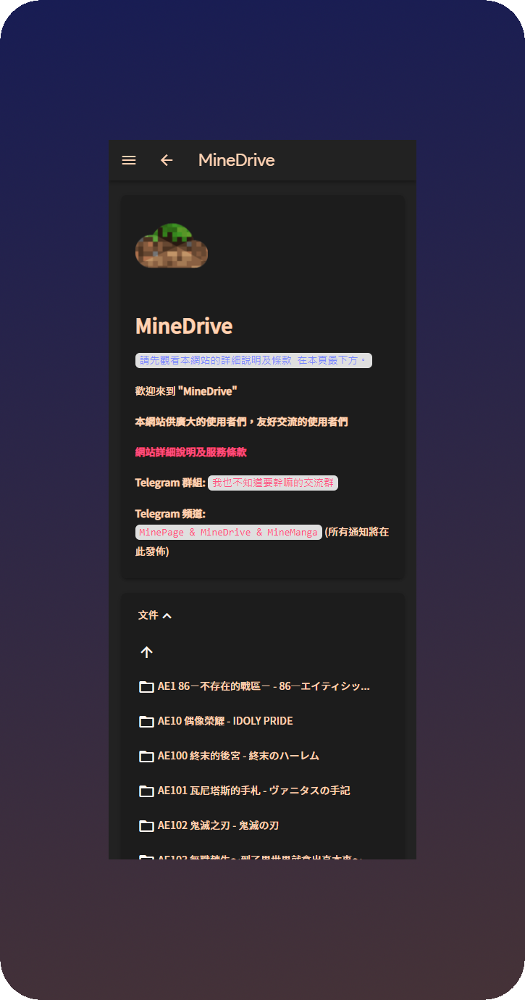
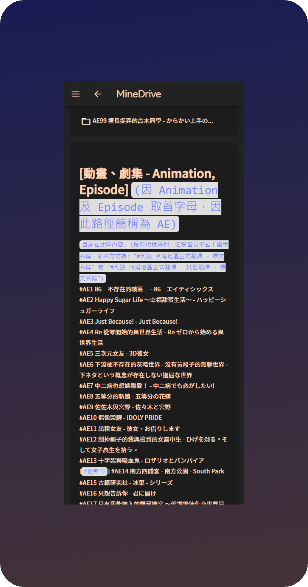
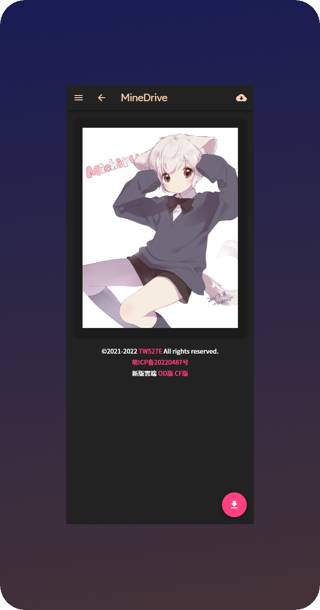
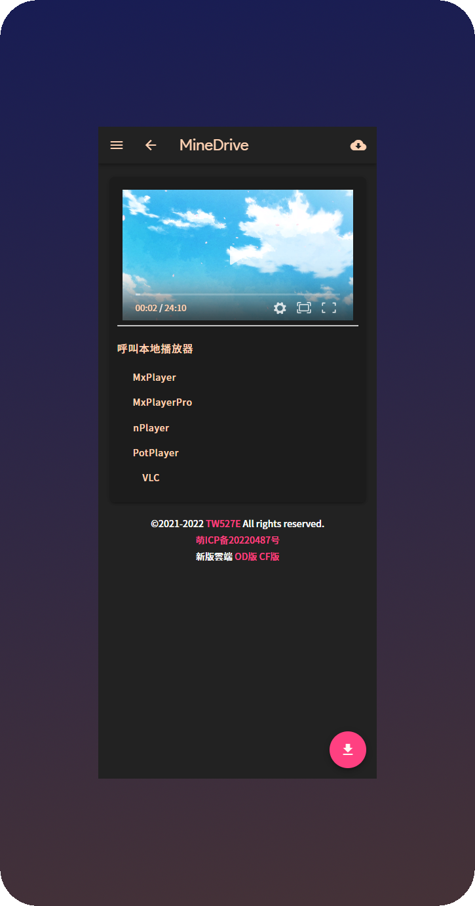
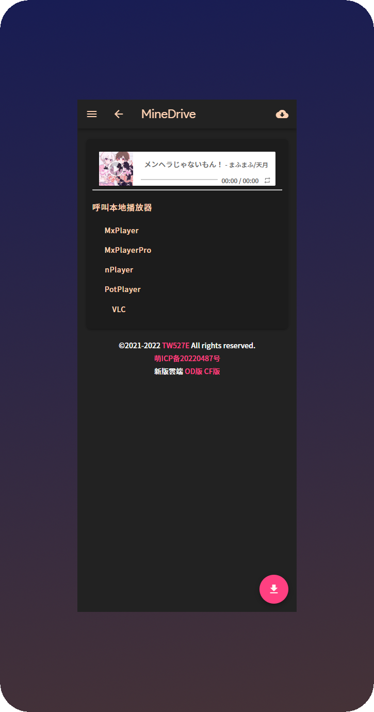
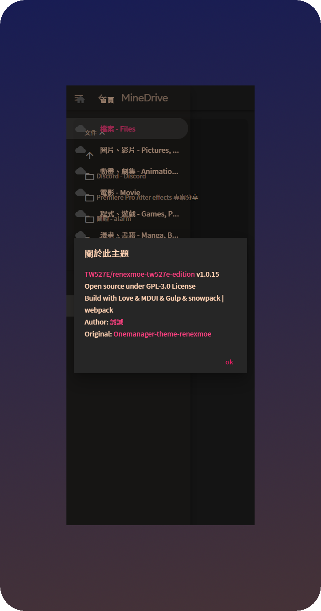

</Pre>

